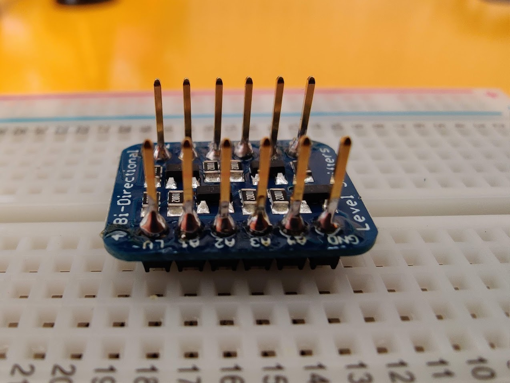
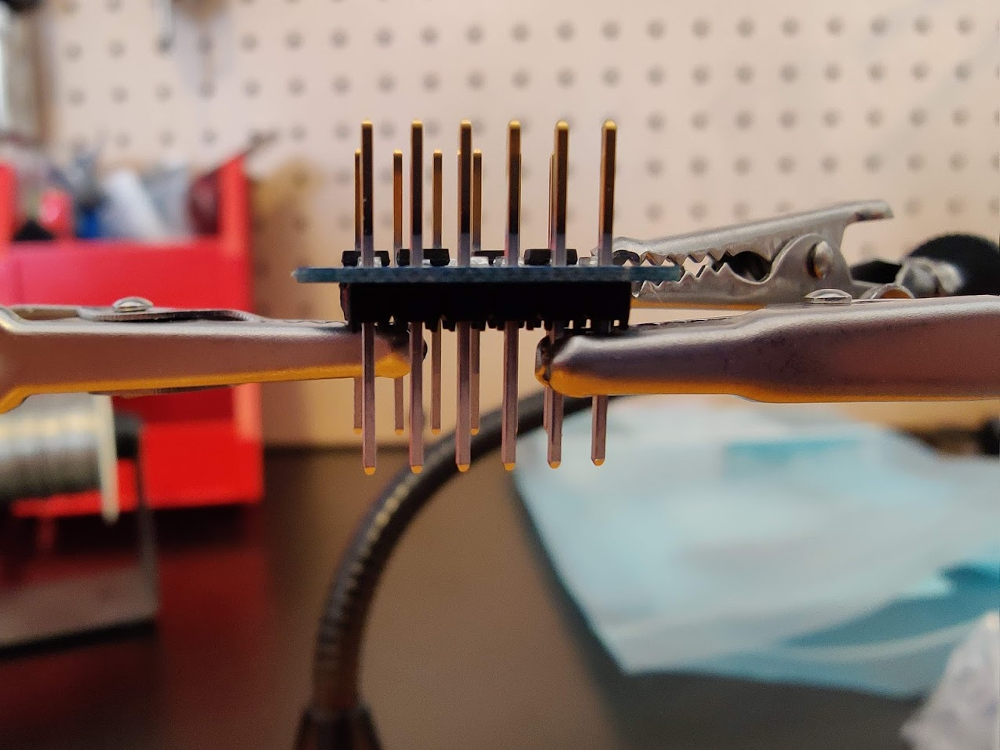
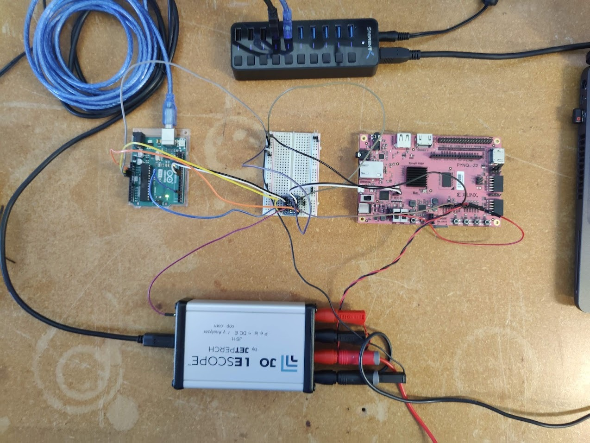
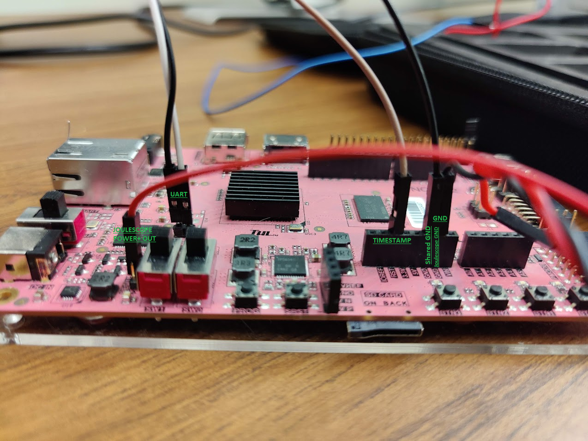
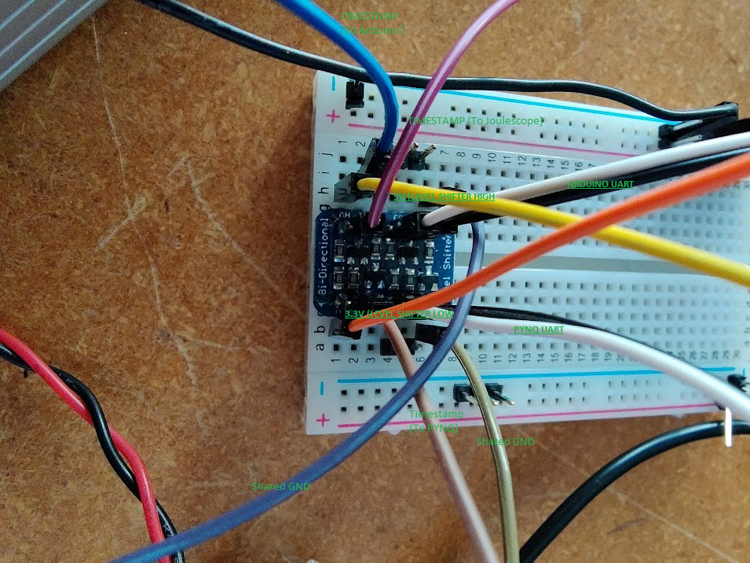
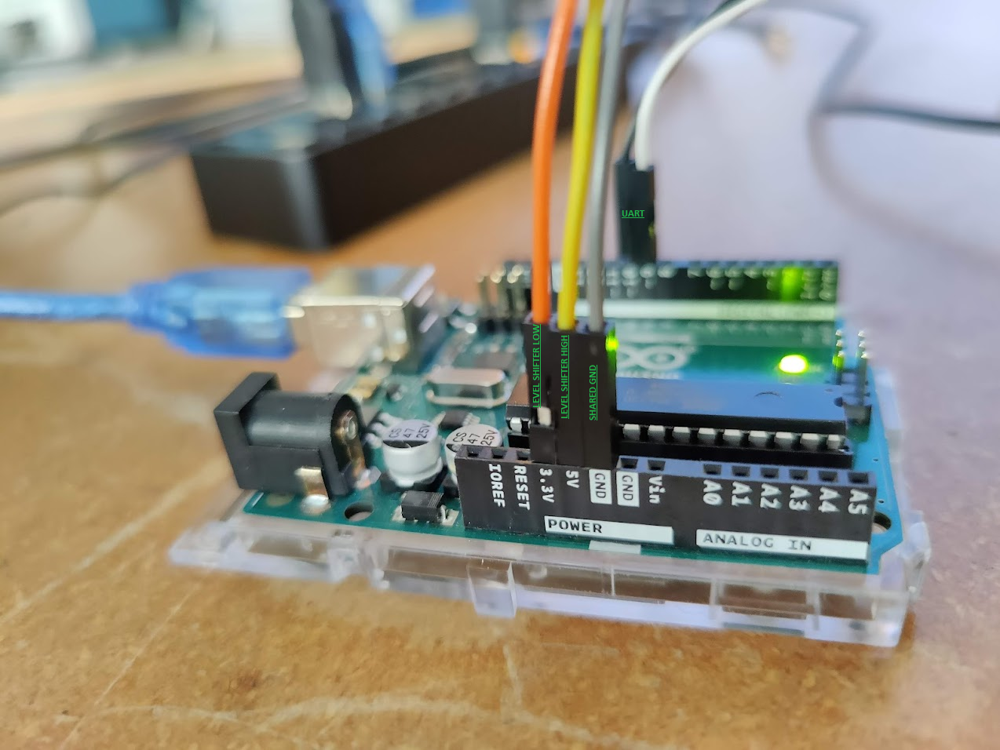

## Pynq-Z2 Energy Benchmark Setup and Hookup Guide

### Components/Bill of Materials

-   [Pynq-Z2 Board](https://www.newark.com/tul-corporation/1m1-m000127dva/tul-pynq-z2-advanced-kit-rohs/dp/69AC1753)
-   Micro USB-B cable (Included with Pynq-Z2)
-   Host Computer with a USB Port (Linux/Windows/OSX, preference in that order)
-    [EEMBC EnergyRunner Software](https://github.com/eembc/energyrunner) (Binary download available through [EEMBC Website](https://www.eembc.org/) once signed up/approved)
    -   Relevant dataset `.bin` files (Anomoly Detection, Image Classification, and Keyword Spotting for the HLS4ML/Xilinx joint submission)
-   [Joulescope JS110](https://www.digikey.com/en/products/detail/joulescope%C2%AE/JS110-K000-001/13686734)
-   [Breadboard (Pololu 400pt)](https://www.digikey.com/en/products/detail/pololu-corporation/351/11586984) 
-   [Bi-Directional Level Shifters (BSS138x4 Board)](https://www.digikey.com/en/products/detail/adafruit-industries-llc/757/4990756)
-   [Arduino UNO ("IO Manager")](https://www.digikey.com/en/products/detail/arduino/A000066/2784006)
-   [Header Pins (Extra Tall)](https://www.digikey.com/en/products/detail/samtec-inc/MTSW-110-09-S-S-330/8162605) 
-   [Breadboard Jumper Wires (M-M, M-F, F-F)](https://www.amazon.com/EDGELEC-Breadboard-Optional-Assorted-Multicolored/dp/B07GD2BWPY)
-   [Stackable 4mm Banana Plug Test Leads](https://www.amazon.com/Sumnacon-Stackable-Silicone-Multimeter-Electrical/dp/B07179VF5J/)
-   [4mm Banana Plug to Jumper Wire Test Leads](https://www.amazon.com/Goupchn-Stackable-Breadboard-Flexible-Electrical/dp/B08KZGPTLM?th=1) (Male or Female, you need both but can use the Breadboard jumper wires to convert)
-   [Powered USB 3.0 Hub (with at least 3 Ports)](https://www.digikey.com/en/products/detail/adafruit-industries-llc/757/4990756) 
-   [USB-B → USB-A Cable](https://www.amazon.com/StarTech-com-3-Feet-USB-Certified-Cable/dp/B001GTW5Z2) (2 x Total, One for the Joulescope (Included), one for the Arduino UNO (Not included))
-   A 5-12V+, >3A Low Noise, Variable Power Supply with 4MM Banana Plug Outputs (This can vary, but the lowest noise/ripple you can get is desirable. Avoid cheap, no-name brands if possible. lower noise means more accurate/better results)
    -   [Siglent SPD3303C](https://www.amazon.com/Siglent-Technologies-SPD3303C-Power-Supply/dp/B01HENYNZS)
    -   [Miniware MDP-P905](https://www.amazon.com/SainSmart-MDP-P905-Programmable-Adjustable-Regulator/dp/B07ZCJGP1V) \*\*AND\*\* [iFi iPower Low Noise Travel Adapter (5V)](https://www.amazon.com/iPower-Supply-International-Travel-Adapters/dp/B01LZD8SHJ)
    -   [HP/Agilent E3610A](https://www.bellnw.com/manufacturer/Agilent/E3610A.htm) (What was used for benchmarking)

### Soldering Required

For the energy Setup, some minor soldering needs to be done. Specifically:

-   Soldering a 1x2 0.10" Header Pin onto the Pynq-Z2's UART Connection
-   Soldering extra tall header pins onto the Bidirecctional level shifter (BSS138x4) breakout board

#### Pynq-Z2 UART Header Pins

A 1x2 set of standard, 0.10" pitch header pins need to be soldered onto J13 to allow the Arduino UNO to connect to the Pynq-Z2 over UART via standard jumper wires. J13 is located right next to the FTDI Serial chip, above the bank of two toggle switches.  
  
Note that if you need standard 0.10" pitch header pins, a set comes with the BSS138 breakout board that aren't needed for that board (we use the extra tall headers instead, more detail below). 

Pynq-Z2 Board with Header J13 Circled

J13 is unpopulated from the factory, but the holes are filled with solder. This is lead free solder, so it's likely going to be a pain to deal with. Be patient, try to remove the solder from the holes first, then re-tin them with good, leaded solder and plenty (however much you think is reasonable, then add more) of liquid/paste flux. After re-tinning them, then try to solder the 1x2 Header pins to the board. The plastic spacers on the 1x2 Header pins should be on the top side of the board.

#### Bidirectional Level Shifter Header Pins

This soldering job is comparatively easier, and consists of soldering the extra tall header pins onto the BSS138 Breakout board. The correct orientation is so that the gold plated ends of the header pins are sticking out of the top of the BSS138 Breakout board, with the plastic spacer underneath the board itself, so that when plugged into a breadboard it sits on the plastic spacer 

BSS138 Breakout Board with pins soldered inserted into breadboard

BSS138 Breakout Board with Extra Tall header pins in correct orientation

### Setup

To setup for an Energy Consumption Benchmark:

1.  Connect everything according to this wiring diagram where the DUT is the Pynq-Z2 (All devices powered off)

MLPerf Tiny V1.0 Energy Benchmark Wiring Diagram for Pynq-Z2

1.  Power on the Powered USB hub, this will also power the Arduino UNO ("IO Manager") & Joulescope, but no power will be coming out of the Joulescope output at this point
2.  Power on the Low Noise DC Power supply, setting it to output **5V** (Different than the Arty!)
3.  If you haven't already, flash the Arduino UNO with the IOManager `.hex` file (available from the [EEMBC download page](https://www.eembc.org/energyrunner/mlperftiny/), login/free account required) via your preferred flashing program ([AVRDUDE](https://www.nongnu.org/avrdude/), [XLoader](https://github.com/binaryupdates/xLoader), [AVRDUDESS](https://github.com/zkemble/AVRDUDESS), etc.)
4.  Make sure the power switch next to the micro USB connector on the Pynq-Z2 is set ***OFF*** (towards the outside edge of the board)
5.  Connect the Pynq-Z2 to the Host Computer via micro USB-B cable
6.  Making sure the power jumper (J9) is set to “USB”, set the power switch next to the micro USB connect to ***ON***
7.  If you haven't already, follow the instructions in the README.md of the hls4ml Submission to build/run the model on the PYNQ-Z2 [v1.0 Readme](README.md)
8.  ***_Flash the board with the FSBL as described in the [README](pynq_bootloader.md)_***
9.  Set the Power Switch to ***OFF***
10.  Disconnect the MicroUSB Cable from the Pynq-Z2
11.  Disconnect the Jumper from header J9, connecting the Joulescope's positive output to the center pin of the header (J9-2)
12.  Set the power switch next to the micro USB connect to ***ON***
13.  With the submission running on the board, open EEMBC's EnergyRunner  
    i. If you haven't already, note the “Dataset Folder” location shown at the bottom of the “BENCHMARKS AND TEST SCRIPTS” box and move your `.bin` files to that location, in the format of a directory named the benchmark id (`kws01, ic01, ad01, vww01` etc.) containing that benchmark's `.bin` files.
    
15.  Follow the instructions from the [v1.0 README](README.md) to run the benchmark  

Additional photos of the actual setup have been included below for reference (if there is any question between these and the diagram, follow the wiring diagram above)

MLPerf Tiny V1.0 Energy Benchmark Physical Setup mirroring the above wiring diagram

MLPerf Tiny V1.0 Energy Benchmark wiring for Pynq-Z2

MLPerf Tiny V1.0 Energy Benchmark wiring for Level Shifter

MLPerf Tiny V1.0 Energy Benchmark wiring for Arduino UNO ("IO Manager")
